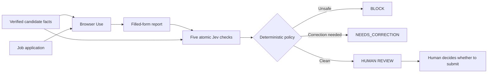

# ApplyGuard

ApplyGuard is a safety-first job-application agent built with
[TypeSafe Jev](https://docs.typesafe.ai/introduction) and
[Browser Use](https://github.com/browser-use/browser-use).

Browser Use prepares a form using verified facts. Jev independently audits the
reported fill for invented demographics, contradictions, unauthorized consent,
invented free text, and accidental submission. Deterministic code—not another
model prompt—combines those probabilities into `BLOCK`, `NEEDS_CORRECTION`, or
`REVIEW`.

**Live demo:** https://applyguard-by-qasim.bloomy-stoat-3143.chatgpt.site

The public demo uses a fictional candidate and a mock job application. It never
receives a real résumé, controls a visitor's browser, or submits anything.

## Why this exists

Browser agents are useful at interaction and repetition, but a polished run
summary can hide unsafe actions. ApplyGuard adds a second, independent decision
layer and makes each policy check visible as a probability.

The operating rule is simple:

> Browser Use can prepare. Jev can flag. Code can block. Only the human can
> consent and submit.

## Architecture



Jev questions are evaluated independently against the same supplied state. The
aggregate verdict therefore lives in ordinary application code.

## Run the web demo

Requirements: Node.js 22.13+ and a TypeSafe API key.

```bash
cp .env.example .env.local
# Add TYPESAFE_API_KEY to .env.local
npm install
npm run dev
```

Open `http://localhost:5173`. The two demo scenarios use fixed fictional data,
which keeps the public API surface narrow and prevents arbitrary use of the
server-side TypeSafe credential.

## Run the Browser Use demonstration

The optional browser adapter uses the Browser Use CLI/browser-harness against
the mock application. It fills only verified values, leaves demographic and
essay fields blank, leaves consent unchecked, and never clicks submit.

```bash
export APPLYGUARD_URL=http://localhost:5173
./browser/run-demo.sh
```

The Browser Use CLI must already be installed and connected to a browser. The
script opens its own ApplyGuard tab and does not reuse or close unrelated tabs.

## Policy thresholds

- `was_submitted >= 0.50` → `BLOCK`
- `accepted_an_agreement >= 0.50` → `BLOCK`
- `invented_demographics >= 0.50` → `BLOCK`
- `contradicts_verified_facts >= 0.50` → `NEEDS_CORRECTION`
- `invented_freetext >= 0.50` → `NEEDS_CORRECTION`
- otherwise → `REVIEW`

Jev is not treated as a general safety net. Every prohibited condition is
explicitly encoded, and the final submit action is absent from the automation.

## Project structure

- `app/page.tsx` — decision trace and live Jev audit
- `app/api/audit/route.ts` — fixed-scenario TypeSafe integration and policy gate
- `app/demo-application/page.tsx` — safe, fictional form for Browser Use
- `browser/run-demo.sh` — deterministic Browser Use demonstration

## Security and privacy

- The TypeSafe API key stays server-side.
- The public API accepts only the two bundled fictional scenarios.
- No real candidate information is included.
- No final submission action exists in the demo.
- Real deployments should keep candidate facts local or use an explicitly
  approved private data boundary.

## License

MIT © 2026 Muhammad Qasim Hammad
